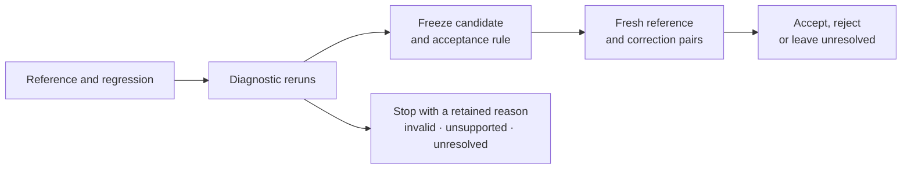

# Nisayon

**Experiments for robot-policy integration.**

A robot policy can fail after a deployment change while its learned weights
stay fixed. An observation arrives late, an action changes meaning, or recurrent
state survives a reset. Each suggests a different correction. A successful
rerun alone does not tell us whether that correction deserves acceptance.

Nisayon executes bounded experiments, checks the evidence and tests a frozen
correction on fresh conditions. It keeps failed attempts and returns unresolved
when the observations cannot support a decision. The current implementation
runs one frozen robomimic BC-RNN Lift policy in a headless CPU robosuite/MuJoCo
simulator. Its scope is explicit and its results are open to inspection.

[Results](#what-the-experiments-found) · [Run it](#reproduce) ·
[Experiment records](docs/experiments/README.md) · [Release](docs/RELEASE.md) ·
[Apache-2.0](LICENSE)

## What the experiments found

**No decision or efficiency advantage has been demonstrated.** Both comparisons
are retained, including failed, invalid, unsupported and unresolved assignments.

| Development comparison | Accepted A / B | Runs per arm | Trial time A / B |
|---|---:|---:|---:|
| [Scripted diagnostic procedures, ten incidents](docs/experiments/MATCHED_COMPARISON.md) | 6/10 / 6/10 | 569 | 881.95 s / 926.20 s |
| [Live model, three paired repetitions of one known incident](docs/experiments/BOUNDED_AGENT_COMPARISON.md) | 3/3 / 3/3 | 210 | 422.27 s / 435.16 s |

A is the competent conventional workflow; B has the same information and
opportunities plus Nisayon checks. In the scripted comparison B's extra checks
changed no decision. In the bounded model comparison both arms used
`gpt-6-astra`, medium reasoning, with equal budgets. B requested no optional
audit; both still used the common execution and mandatory confirmation service.
Three repetitions of one known incident are not three independent incidents.

Each accepted repair passed 32/32 fresh reference/candidate pairs. No false
acceptance was detected under the shared checker. D05 remains rejected under
the original absolute progress rule, D06 unsupported, D08 invalid and D10
unresolved. These are simulator development results, not evidence of physical
safety, general causal identification, unseen-fault performance or customer savings.

B measured about 5% and 3% more trial time in the respective schedules. These
times include nested execution and checking once; shared preparation and failed
development attempts are reported separately. Human effort, provider charges
and energy remain unknown. The [trace and cost analysis](docs/experiments/UNUSED_AUDIT.md)
explains why free diagnosis still cannot meet a 2× total-cost target with these
fixed confirmation schedules. A broader three-arm screen remains a proposal in
the [research plan](docs/RESEARCH_PLAN.md).

## How a correction earns acceptance



Changing an action requires recomputing its affected future state and
observations. Replaying observations from the old trajectory cannot establish
what the intervention would do. Nisayon therefore executes each supported
intervention as a full closed-loop rerun; partial continuation is unsupported.

The evaluator checks source and configuration identity, acquisition timing,
reset evidence, candidate scope, confirmation freshness and task progress.
Stopping the robot fails the progress obligation. A completed process, a valid
measurement and an accepted repair are distinct results. The
[contract](docs/evaluation/CONFIRMATION_OBLIGATION.md) and
[adversarial controls](docs/evaluation/CONTROLS.md) make those distinctions executable.

## Reproduce

### Check the source and retained scores

Install Python 3.12, Git, [uv](https://docs.astral.sh/uv/) and
[ripgrep](https://github.com/BurntSushi/ripgrep#installation). Workspace search
uses the `rg` executable. On macOS, `brew install ripgrep` supplies it; on
Debian or Ubuntu, use `sudo apt-get install ripgrep`. Then run:

```sh
uv sync --frozen
make check
uv run --frozen python -m nisayon.evaluation score \
  docs/experiments/results/development-ablation-001/comparison-ledger.json \
  --root docs/experiments/results/development-ablation-001
uv run --frozen python -m nisayon.evaluation score \
  docs/experiments/results/bounded-agent-comparison-001/comparison-ledger.json \
  --root docs/experiments/results/bounded-agent-comparison-001
```

Those commands re-score the retained compact evidence. They do not execute
physics or independently reconstruct every raw store. Exact historical source,
protocol identities and reproduction limits are in the [release notes](docs/RELEASE.md).

### Run five simulator trajectories

The example executes two references, a sign regression, a correction and action
suppression on a known condition. Use a new output directory:

```sh
uv sync --frozen --extra simulation
uv run --frozen python -m nisayon.engine.first_case \
  --output artifacts/release-example --assets artifacts/assets --explore-only
uv run --frozen python -m nisayon.engine.integrate \
  --bundle artifacts/release-example/bundle.json \
  --artifact-root artifacts/release-example \
  --output artifacts/release-example-evaluation
```

The adapter downloads the pinned policy once, verifies its SHA-256, and reuses
it. Read the [asset identity and upstream terms](docs/experiments/ASSETS.md)
before obtaining the checkpoint; weights and training data are not distributed
here. The measured stack is Python 3.12.13, robomimic 0.3.0, robosuite 1.4.1,
MuJoCo 3.2.7, Torch 2.5.1 and NumPy 1.26.4 on macOS arm64. Other environments
need qualification. This adapter does not reproduce the original model-zoo study.

The small example should reproduce task completion for reference and correction,
failure for regression and suppression, and rejection of deliberately invalid
replay. Its correction stays **unresolved for acceptance** because exploration
does not supply fresh confirmation. It cannot replace the retained scored result.
The [first joint experiment](docs/experiments/LIFT_PROTOCOL_V3.md) documents the
larger, already completed fresh confirmation; its spent seeds must not be reused
as new confirmation.

## What would justify the next experiment

The scripted comparison exposed a fixed selector that already knew its remedy.
Replacing it with a live model gave both arms a more direct procedure, but the
optional audit still changed no decision. That is a sharper account of the
limitation, with the original negative results preserved.

Another comparison needs an ambiguous engineering decision that ordinary
telemetry cannot already resolve equally cheaply, and enough avoidable work
for the extra experiment to earn its cost. The
[trace analysis](docs/experiments/UNUSED_AUDIT.md) sets out that requirement.
Repeating the same known repair would add runs without answering it.

## Read and contribute

| To inspect | Start here |
|---|---|
| Measurements, failures and corrections | [Experiment records](docs/experiments/README.md) |
| Implemented boundaries and proposed extensions | [Architecture](docs/ARCHITECTURE.md) |
| Installation, tests and command records | [Development](docs/DEVELOPMENT.md) |
| Exact historical sources and reproduction limits | [Research release](docs/RELEASE.md) |
| A concrete defect or contribution | [Contribution guide](CONTRIBUTING.md) |

Reports preserve the state known when they were written. The release notes
identify subsequent corrections; the original records remain available.

Licensed under [Apache-2.0](LICENSE). Copyright 2026 Daniel Wahnich.
[Licensing scope and third-party assets](docs/LICENSING.md) distinguish the
released source from separately obtained dependencies and policy weights.

We let experiments overturn our explanations. We preserve failures and
uncertainty. We accept an improvement only when fresh, valid tests support it.

*Nisayon — ניסיון — experience; an attempt. Built by Daniel Wahnich.*
