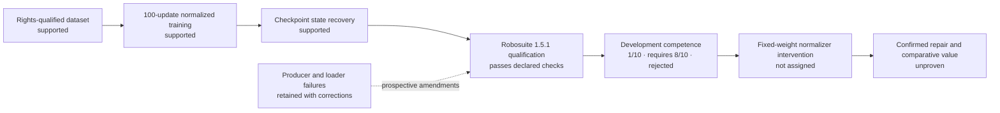
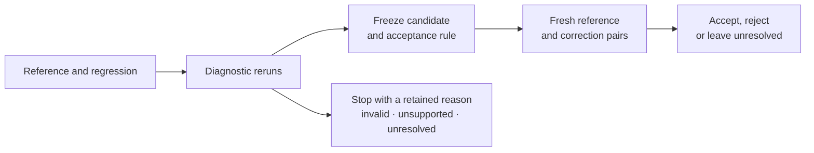

# Nisayon

**Experiments for robot-policy integration.**

A robot policy can fail after a deployment change while its learned weights
stay fixed. An observation arrives late, an action changes meaning, or recurrent
state survives a reset. Each suggests a different correction. A successful
rerun alone does not tell us whether that correction deserves acceptance.

Nisayon executes bounded experiments, checks the evidence and tests a frozen
correction on fresh conditions. It keeps failed attempts and returns unresolved
when the observations cannot support a decision. The established Lift case runs
one frozen robomimic BC-RNN policy in a headless CPU robosuite/MuJoCo simulator.
A separate line qualified a robosuite 1.5.1 runtime, rejected its normalized pilot
checkpoint at 1/10 task success, and confirmed a narrowly scoped input-convention
correction for a legacy policy at 9/10 versus 0/10 unchanged. These systems and
their claims remain separate.

A separate software harness exercises action chunks, late responses, clock
uncertainty and resets with scripted inputs. It runs queue and lifecycle code,
including a pinned historical LeRobot reset defect and its fix. It does not run
robot dynamics or learned inference.

[Results](#what-the-experiments-found) · [Current boundary](#current-evidence-boundary) ·
[Run it](#reproduce) ·
[Experiment records](docs/experiments/README.md) · [Release](docs/RELEASE.md) ·
[Apache-2.0](LICENSE)

## What the experiments found

**No decision or efficiency advantage has been demonstrated.** Both comparisons
are retained, including failed, invalid, unsupported and unresolved assignments.

| Development comparison | Accepted A / B | Runs per arm | Trial time A / B |
|---|---:|---:|---:|
| [Scripted diagnostic procedures, ten incidents](docs/experiments/MATCHED_COMPARISON.md) | 6/10 / 6/10 | 569 | 881.95 s / 926.20 s |
| [Live model, three paired repetitions of one known incident](docs/experiments/BOUNDED_AGENT_COMPARISON.md) | 3/3 / 3/3 | 210 | 422.27 s / 435.16 s |

A is the competent conventional workflow; B has the same information and
opportunities plus Nisayon checks. In the scripted comparison B's extra checks
changed no decision. In the bounded model comparison both arms used
`gpt-6-astra`, medium reasoning, with equal budgets. B requested no optional
audit; both still used the common execution and mandatory confirmation service.
Three repetitions of one known incident are not three independent incidents.

Each accepted repair passed 32/32 fresh reference/candidate pairs. No false
acceptance was detected under the shared checker. D05 remains rejected under
the original absolute progress rule, D06 unsupported, D08 invalid and D10
unresolved. These are simulator development results, not evidence of physical
safety, general causal identification, unseen-fault performance or customer savings.

B measured about 5% and 3% more trial time in the respective schedules. These
times include nested execution and checking once; shared preparation and failed
development attempts are reported separately. Human effort, provider charges
and energy remain unknown. The [trace and cost analysis](docs/experiments/UNUSED_AUDIT.md)
explains why free diagnosis still cannot meet a 2× total-cost target with these
fixed confirmation schedules. A broader three-arm screen remains a proposal in
the [research plan](docs/RESEARCH_PLAN.md).

## Current evidence boundary

The A1 experiment asked whether an actively normalized policy could be
bound to a compatible task runtime and then evaluated without confusing training,
runtime, competence and repair claims. The bounded offline pilot completed all
100 assigned CPU optimizer updates. Its normalization reached the learner exactly,
its parameters changed, and its checkpoint state reloads within the measured cap.
That establishes a training operation, not a competent policy.

On 9 October, the isolated robosuite 1.5.1 runtime passed its declared compatibility
checks. The exact checkpoint then completed **1 of 10** development tasks against
the frozen **8 of 10** requirement. All episodes completed without an execution
failure. The checkpoint is rejected as the working reference for repair experiments
in this runtime. Producer mapping, recording and checkpoint-serialization failures
remain retained alongside their tested corrections; 1,106 software tests pass.
Full historical trajectory fidelity remains a separate limitation, and this
assessment is single-lane and non-independent. See the
[runtime execution record](docs/experiments/results/a1-runtime-001/README.md) and
[current handoff](docs/SESSION_HANDOFF.md).

A separate [policy-transfer experiment](docs/experiments/results/b2-semantic-transfer-001/README.md)
found a semantic change hidden by identical observation dimensions: robosuite
reversed the gripper/cube relative-position vector between versions. A correction
limited to the exact legacy checkpoint's input convention completed **9/10** fresh
paired conditions, versus **0/10** unchanged. All twenty episodes completed,
captured initial conditions matched, and weights stayed fixed. One condition
still failed. The result qualifies this corrected reference and a bounded repair;
it does not establish superior diagnosis or complete engineering cost. All
1,130 software tests pass. Execution and assessment remain single-lane.

The [portable evidence reader](docs/experiments/TRANSFER_EVIDENCE.md) recomputes
that paired result and checks the recorded network inputs from the sealed raw
packet. It runs without the simulator stack and makes no new task-success claim.

The [9 October source update](docs/RELEASE.md#source-update--9-october-2026)
also includes a qualified clean development install and a correction to the
condition-history receipt digest. Historical experiment outcomes remain unchanged.


```mermaid
flowchart LR
    accTitle: A1 normalized-policy evidence ladder
    accDescr: Dataset custody, normalized training and checkpoint recovery are supported. The runtime passes its declared qualification checks, but the A1 checkpoint succeeds in only one of ten development episodes against the required eight. That normalized checkpoint remains rejected; the separate B2 legacy-policy repair does not change this result.
    D["Rights-qualified dataset<br/>supported"] --> T["100-update normalized training<br/>supported"]
    T --> C["Checkpoint state recovery<br/>supported"]
    C --> R["Robosuite 1.5.1 qualification<br/>passes declared checks"]
    R --> K["Development competence<br/>1/10 · requires 8/10 · rejected"]
    K --> I["Fixed-weight normalizer intervention<br/>not assigned"]
    I --> V["Confirmed repair and comparative value<br/>unproven"]
    F["Producer and loader failures<br/>retained with corrections"] -. "prospective amendments" .-> R
```

The later [controller-target probe](docs/experiments/results/decision-case-001/README.md)
retained six executions across three exposed condition pairs. The observed
differences crossed no confirmation predicate and changed no repair decision.
Neither controller convention was selected. The report preserves the timing
of the corrected admission rule and the limits of this small negative result.

The [confirmation evidence adapter](docs/experiments/results/confirmation-engine-001/README.md)
makes the existing cost and outcome records usable for further analysis. It
retains all 26 assigned trials, including six that never reached confirmation,
and all 660 scheduled pairs. D05's executed prefixes and progress failure remain
visible. The adapter verifies the retained raw evidence, preserves measurements
in their original units and reports missing or invalid inputs explicitly. Its
read-only export changes no historical decision or confirmation stopping rule.

The [temporal software experiment](docs/experiments/results/temporal-integration-001/README.md)
accounts for all 230 role assignments and three separate interrupted prefixes.
The source-bound audit verifies complete owner coverage and identical events
and assessments on all 35 declared conventional/selected pairs. The reference
distinguishes activation context, individual sends, exact clock arithmetic and
the identity actually admitted to the queue. Contradictory clock declarations
remain unresolved in either order; a refused delivery cannot overwrite a queued
action's provenance. Both frozen usefulness criteria and later retrospective
readings remain explicit. No advantage over the conventional remedy is
established. The
[combined freshness check](docs/experiments/results/temporal-integration-001/COMBINED_DEADLINE.md)
preserves a fresh queued action when an overdue response arrives, then checks
age again at dispatch. Both comparators receive it and tie on all six exposed
controls. The [closeout record](docs/experiments/results/temporal-integration-001/CLOSEOUT.md)
retains the corrected readings, original failures, known costs and supported
scope. These software results do not establish robot task success.

The [external processor decision](docs/experiments/results/external-decision-001/README.md)
uses one public LeRobot report, pinned processor code and the retained SmolVLA
configuration/statistics bytes. The shipped files skip both required exact-key
transforms; suffix matching repairs only action and chooses among three datasets by
store order. An explicit override transforms state and action and preserves legitimate
visual identity, but its deployment binding remains unresolved because the retained
artifact has no dataset selector and the state statistics are only a reporter
transcription. All 18 arm executions agree with the separate reference and eight
controls pass. The A/B tie establishes no value advantage: A's outcomes are constants
on the same executor and witnesses used by B. No model, simulator or robot ran.

## How a correction earns acceptance


```mermaid
flowchart LR
    accTitle: Nisayon's implemented experiment path
    accDescr: Reproduce the reference and regression, execute diagnostic reruns, freeze a candidate and its rule, then confirm on fresh conditions. Diagnostic gaps stop the path. Every outcome is retained.
    R["Reference and regression"] --> D["Diagnostic reruns"]
    D --> F["Freeze candidate<br/>and acceptance rule"]
    D --> U["Stop with a retained reason<br/>invalid · unsupported · unresolved"]
    F --> C["Fresh reference<br/>and correction pairs"]
    C --> V["Accept, reject<br/>or leave unresolved"]
```

Changing an action requires recomputing its affected future state and
observations. Replaying observations from the old trajectory cannot establish
what the intervention would do. Nisayon therefore executes each supported
intervention as a full closed-loop rerun; partial continuation is unsupported.

The evaluator checks source and configuration identity, acquisition timing,
reset evidence, candidate scope, confirmation freshness and task progress.
Stopping the robot fails the progress obligation. A completed process, a valid
measurement and an accepted repair are distinct results. The
[contract](docs/evaluation/CONFIRMATION_OBLIGATION.md) and
[adversarial controls](docs/evaluation/CONTROLS.md) make those distinctions executable.

## Reproduce

### Check the source and retained scores

Install Python 3.12, Git, [uv](https://docs.astral.sh/uv/) and
[ripgrep](https://github.com/BurntSushi/ripgrep#installation). Workspace search
uses the `rg` executable. On macOS, `brew install ripgrep` supplies it; on
Debian or Ubuntu, use `sudo apt-get install ripgrep`. Then run:

```sh
uv sync --frozen
make check
uv run --frozen python -m nisayon.evaluation score \
  docs/experiments/results/development-ablation-001/comparison-ledger.json \
  --root docs/experiments/results/development-ablation-001
uv run --frozen python -m nisayon.evaluation score \
  docs/experiments/results/bounded-agent-comparison-001/comparison-ledger.json \
  --root docs/experiments/results/bounded-agent-comparison-001
```

Those commands re-score the retained compact evidence. They do not execute
physics or independently reconstruct every raw store. Exact historical source,
protocol identities and reproduction limits are in the [release notes](docs/RELEASE.md).

To export the complete confirmation evidence and reproduce its cost partition
from the existing local raw stores, use a new output directory:

```sh
uv run --frozen nisayon run --label confirmation-evidence-export -- \
  python -m nisayon.engine.confirmation_view --out artifacts/confirmation-export
```

This command executes no simulator trajectories. It needs the original raw
stores as well as the compact records; `--raw-base` specifies their location.
The [adapter report](docs/experiments/results/confirmation-engine-001/README.md)
describes its pinned inputs, output manifest, deterministic pair iterator and
recovery checks. Statistical consumption is retrospective: the exposed records
do not establish the sampling assumptions of a new decision contract.

### Exercise a late response after reset

This small example runs six remedies on the same frozen software schedule and
applies the separate temporal reference. Use a fresh output directory:

```sh
uv run --frozen python -m nisayon.engine.temporal_experiment workflow \
  --suite docs/experiments/temporal-late-reset.example.json \
  --out artifacts/temporal-late-reset-example
```

The output separates process completion, retained evidence, temporal predicates
and software dispatch coverage. Robot task outcome remains unmeasured. The
[interface](docs/experiments/TEMPORAL_INTERFACE.md) documents complete and
interrupted inspection and the exact historical source reproduction.

### Run five simulator trajectories

The example executes two references, a sign regression, a correction and action
suppression on a known condition. Use a new output directory:

```sh
uv sync --frozen --extra simulation
uv run --frozen python -m nisayon.engine.first_case \
  --output artifacts/release-example --assets artifacts/assets --explore-only
uv run --frozen python -m nisayon.engine.integrate \
  --bundle artifacts/release-example/bundle.json \
  --artifact-root artifacts/release-example \
  --output artifacts/release-example-evaluation
```

The adapter downloads the pinned policy once, verifies its SHA-256, and reuses
it. Read the [asset identity and upstream terms](docs/experiments/ASSETS.md)
before obtaining the checkpoint; weights and training data are not distributed
here. The measured stack is Python 3.12.13, robomimic 0.3.0, robosuite 1.4.1,
MuJoCo 3.2.7, Torch 2.5.1 and NumPy 1.26.4 on macOS arm64. Other environments
need qualification. This adapter does not reproduce the original model-zoo study.

The small example should reproduce task completion for reference and correction,
failure for regression and suppression, and rejection of deliberately invalid
replay. Its correction stays **unresolved for acceptance** because exploration
does not supply fresh confirmation. It cannot replace the retained scored result.
The [first joint experiment](docs/experiments/LIFT_PROTOCOL_V3.md) documents the
larger, already completed fresh confirmation; its spent seeds must not be reused
as new confirmation.

## What would justify the next experiment

The scripted comparison exposed a fixed selector that already knew its remedy.
Replacing it with a live model gave both arms a more direct procedure, but the
optional audit still changed no decision. That is a sharper account of the
limitation, with the original negative results preserved.

Another comparison needs an ambiguous engineering decision that ordinary
telemetry cannot already resolve equally cheaply, and enough avoidable work
for the extra experiment to earn its cost. The
[trace analysis](docs/experiments/UNUSED_AUDIT.md) sets out that requirement.
Repeating the same known repair would add runs without answering it.

## Read and contribute

| To inspect | Start here |
|---|---|
| Measurements, failures and corrections | [Experiment records](docs/experiments/README.md) |
| Current execution boundary and exact restart gate | [Session handoff](docs/SESSION_HANDOFF.md) |
| Implemented boundaries and proposed extensions | [Architecture](docs/ARCHITECTURE.md) |
| Installation, tests and command records | [Development](docs/DEVELOPMENT.md) |
| Exact historical sources and reproduction limits | [Research release](docs/RELEASE.md) |
| A concrete defect or contribution | [Contribution guide](CONTRIBUTING.md) |

Reports preserve the state known when they were written. The release notes
identify subsequent corrections; the original records remain available.

Licensed under [Apache-2.0](LICENSE). Copyright 2026 Daniel Wahnich.
[Licensing scope and third-party assets](docs/LICENSING.md) distinguish the
released source from separately obtained dependencies and policy weights.

We let experiments overturn our explanations. We preserve failures and
uncertainty. We accept an improvement only when fresh, valid tests support it.

*Nisayon — ניסיון — experience; an attempt. Built by Daniel Wahnich.*
