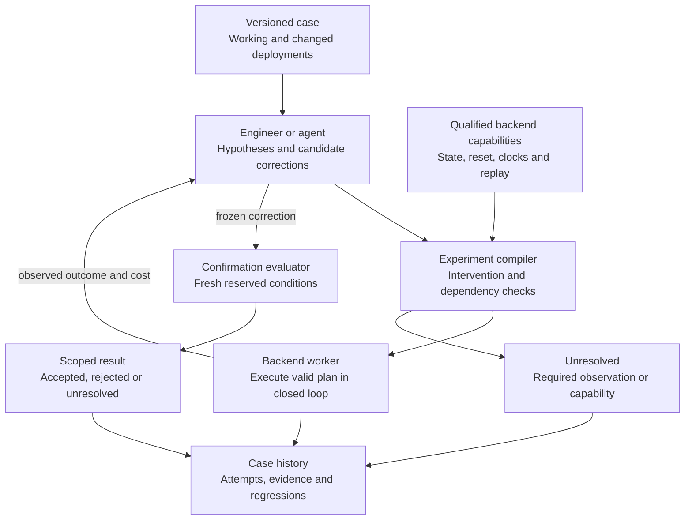
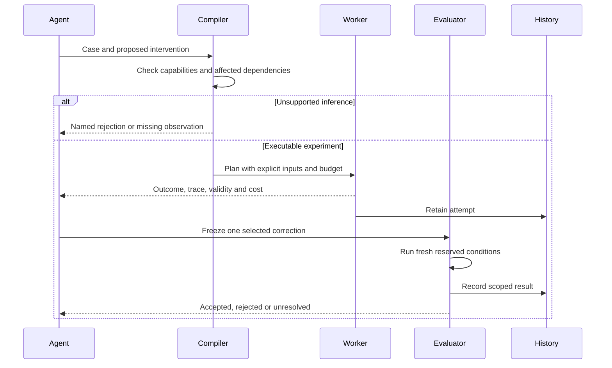

# Architecture

**Design v0.1 · 17 September 2026 · product architecture proposed.**

The workspace tools, one CPU Lift adapter, a finite diagnostic procedure,
fresh-confirmation service and integrated Fable evaluator run today. The
[first case](experiments/LIFT_PROTOCOL_V3.md) retains a regression, correction and
32 paired fresh development conditions. The
[ten-case scripted comparison](experiments/MATCHED_COMPARISON.md) confirms six
incidents in each arm without a demonstrated cost advantage. A general
intervention compiler, adaptive selector, isolated agent interface and reserved
screen remain targets. Their presence in a diagram is not a result.

## The problem we intend to own

A learned policy works in one deployment and fails after a change. Its engineer
has a recording, a code diff, several plausible explanations, and an expensive
way to test each one. Nisayon should turn that situation into a sequence of
valid experiments and a correction that survives fresh confirmation.

The first boundary is policy integration: observation freshness and transforms,
action interpretation, chunk queues, inference timing, controller settings, and
reset state. The first backend is one pinned CPU MuJoCo/robosuite stack with a
frozen policy. The measured backend is qualified only for this finite interface;
other policy families and physical hardware remain unqualified.

The output is a tested correction, its executable regression case, its cost,
and its remaining uncertainty. An unresolved result is useful when it names
the observation needed to distinguish incompatible explanations.

## The proposed system



## Component boundaries

Start with one Python codebase and separate execution processes. Each component
earns distribution when measured throughput, fault isolation, or customer
deployment requires it.

| Component | Responsibility | Output and boundary |
|---|---|---|
| Case capture | Bind deployments, task, failure and relevant assets | Versioned references; large recordings remain in existing storage |
| Backend adapter | Reset, snapshot, execute and report actual actions | Explicit capabilities; unsupported operations remain unsupported |
| Experiment compiler | Resolve intervention effects and dependencies | Executable plan or a named validity rejection |
| Selector | Choose the next useful experiment within budget | Start with competent conventional selection; evaluate adaptive planning separately |
| Worker | Execute a plan and measure its outcome | Trace, process state, measurement state and cost stay separate |
| Confirmation evaluator | Assess a frozen correction on fresh conditions | Scoped result under a frozen obligation |
| Case history | Preserve outcomes, explanations, patches and regressions | Reuse requires a new applicability check |

An existing coding agent reads code, proposes hypotheses, and writes candidate
patches. The agent is replaceable. Typed experiment semantics, execution, and
confirmation belong in ordinary software. The current workspace MCP server
supports engineering these components; it is not their product API.

## Contracts before optimization

The first product records should be small typed Python objects with explicit
serialization versions. Introduce the following when the first adapter needs
them; do not generate empty schemas for an imagined platform.

| Object | Required information |
|---|---|
| `Case` | Working and changed revisions; policy and assets; task predicates; failure reproduction; allowed changes |
| `BackendCapabilities` | Reset semantics; supported snapshots; hidden state; clocks; random streams; observed replay behavior |
| `Intervention` | Changed mechanism; activation time; duration; reset needs; diagnostic substitution or deployable edit |
| `ExecutionPlan` | Input identities; operations to recompute; retained state; declared assumptions; budget |
| `Run` | Intended and executed actions; observations; process result; measurement validity; costs; artifacts |
| `ConfirmationProtocol` | Frozen patch; reserved conditions; outcome, progress and constraint obligations; stopping rule |
| `RepairReport` | Accepted, rejected or unresolved within the protocol; retained evidence; applicability limits |

A `Run` can finish successfully as a process and still contain an invalid
experiment. A valid experiment can leave the decision unresolved. Avoid a
single `success` boolean across these layers.

## Intervention validity

An intervention changes a mechanism. That change determines what must be
recomputed. For the first adapter, **a full closed-loop rerun is the reference
implementation**. Partial reuse must agree with it under stated premises.

| Change | Consequence to check |
|---|---|
| Action or controller output | Recompute affected future plant state and observations |
| Observation transform | Recompute policy inputs and all affected descendants |
| Chunk length, queue alignment or timing | Reconstruct the action schedule; old indices and timings may be inapplicable |
| Controller state or reset | Account for integrators, queues and recurrent policy state |
| Physics, geometry or solver version | Requalify state interpretation and numerical continuation |
| Random draw order | Verify coupling of disturbances; an equal seed alone is insufficient |
| Revised policy from episode start | Recompute its reachable prefix before using a later snapshot |
| Diagnostic oracle observation | Label the substitution; remove it from a deployable correction |



**Established principle.** In a deterministic acyclic dependency graph with
complete read dependencies, recomputing all descendants of a changed node and
retaining unaffected inputs gives the same result as full recomputation.
Induction in topological order proves it. That is ordinary dependency reasoning.
The difficult engineering lies in whether the graph includes the real state,
timing, numerical behavior, and dynamic dependencies. A checksum cannot answer
that question. Differential tests can reveal omissions; passing tests do not
prove a complete model of reality.

## What the decision means

Let `H` be retained evidence and `M(H)` the explicitly declared models consistent
with it. Let `A(m)` be the corrections satisfying the task under model `m`.
The robust decision asks for one common correction:

```text
there exists r such that, for every m in M(H), r belongs to A(m).
```

A different correction for each surviving explanation is insufficient to choose
what to deploy. When no common correction can be justified, the next experiment
should separate explanations that recommend incompatible actions.

This formulation connects to active diagnosis, robust decision theory, and
experimental design. We have not established a new theorem, an efficient general
solver, or a universal causal identification procedure. The near-term research
question is whether this discipline changes the cost and quality of a real
engineering decision. [Source map](SOURCES.md)

## Trust and evaluation

The trusted scope includes parsers, adapter semantics, task predicates, state
capture, measurement, and the confirmation evaluator. Counting only a small
checker would understate it. Solver output can carry an independently checked
artifact where the problem permits one; empirical outcomes still depend on
measurement and operating conditions.

During a comparison, freeze task criteria and reserve confirmation cases outside
the solver's accessible environment. Use separate processes, storage credentials
or machines as required. The full-access developer launchers are convenient
engineering tools; they do not isolate a benchmark. Keep held-out answers out
of shared notes and agent context. Freeze retrieval at the evaluation cutoff.

The first acceptance result covers a finite declared set. Broader stochastic
claims require a justified sampling model and statistical protocol. No automotive
or aerospace safety conclusion follows from a manipulation experiment.

## Storage and growth

The implemented workspace uses Git-tracked JSON notes and checkpoints, plus
ignored local command logs and session snapshots. Unique record files avoid a
shared append-buffer race. Git worktrees keep concurrent changes separate. This
works for a small engineering team and is deliberately easy to inspect.

For product execution, introduce a transactional run registry and an object
store when jobs and assets require them. SQLite is a reasonable first local
registry. Keep large videos and checkpoints out of Git. Store hashes as content
identifiers and preserve provenance; never interpret a hash as scientific
validation. At larger scale, a queue can dispatch the same typed plans to workers
without moving acceptance logic into the agent.

Adapters should depend on a small backend protocol. Begin with one working
adapter. Add a second backend only after the first result survives the baseline.
Keep simulator-specific state and timing semantics at the adapter boundary.

## Implementation order

1. Engineering tools, shared memory and recovery. **Implemented foundation.**
2. One pinned backend and a measured reset/replay qualification.
3. One integration regression, full rerun, and invalid-replay control.
4. Explicit intervention checks and fresh correction confirmation.
5. The three-arm experiment with complete cost accounting.
6. Adaptive selection, reuse and another backend only where evidence supports them.

[Next experiment](RESEARCH_PLAN.md) · [Development](DEVELOPMENT.md) · [README](../README.md)
